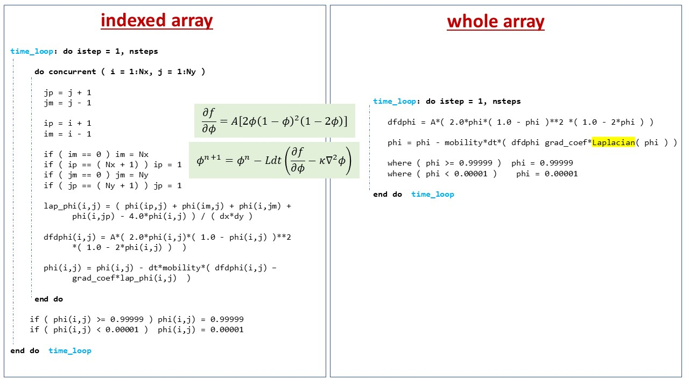

# **Fortran phase-field simulation with whole-arrays**


# **Introduction**
This repository serves as an example of how phase-field models may be used with whole-arrays. The basic idea is presented under

 * Whole-arrays in Fortran
 * Advantages
 * Fortran implementation
 * Performance comparison
 * Summary


The Fortran whole-array is introduced in this document, along with its benefits over the index-array. The next section demonstrates how to use the whole arrays. We compare the performance of two codes and then sum up the concept. 

## **Whole array in Fortran**

In Fortran, an array is a collection of elements of the same data type that are accessed using one or more indices. Whole array operations are a feature in Fortran that allow operations to be performed on entire arrays as a unit, rather than operating on individual elements one at a time.

The concept of whole array operations was first introduced in the Fortran 90 standard. Prior to this, Fortran did not have a built-in mechanism for performing operations on entire arrays at once.

If we wanted to add two arrays together element-wise in Fortran 77, we would need to use a loop that iterates over each element in the arrays. In Fortran 90, we can perform the same operation with a single statement:

```Fortran
C(i) = A(i) + B(i)         ! element by element
C = A + B                  ! whole array
```

where A, B, and C are arrays of the same shape.

Whole array operations in Fortran are supported for a wide range of operations, including arithmetic operations, logical operations, and array transformations such as transposition and reshaping. Fortran also provides built-in functions for performing common array operations such as dot products, matrix multiplication, and FFTs. 

Whole array operations have now become an important feature in Fortran, and they are widely used in scientific and engineering applications where high-performance computing is required.


## **Advantages**

Fortran support for whole-array operations can offer several advantages over element-by-element operations. Here are some advantages of using whole-array operations in Fortran:

**1) Improved Performance:**

 Whole-array operations allow you to process multiple elements of an array in parallel, which can result in faster and more efficient code. When we perform operations on a whole array, Fortran can take advantage of vectorization and other optimizations that are specific to the hardware platform we are running on.

**2) Concise Code:** 

Whole-array operations can often be expressed in fewer lines of code than element-by-element operations, which can make our code more concise and easier to read and maintain.

**3) Improved Clarity:**

Whole-array operations can make the code more readable and easier to understand, especially when we are performing complex operations on large arrays.

**4) Language Consistency:** 

Whole-array operations are consistent with the high-level, mathematical notation used in many scientific and engineering applications, which can make the code more natural and intuitive to work with.

**5) Increased Modularity:** 

By using whole-array operations, we can encapsulate complex operations into subroutines or functions, which can increase the modularity and reusability of our code.

## **How to use it!**

Below we show the code snippets that use array operations in **phase-field method**. In principle, it could be applied to any method . We choose **model A** because of its simplicity.

The left column calls intrinsic routine at each index to generate random numbers for the array. The next statement performs scalar and vector operations at each grid point to get fluctuations. In contrast, the whole array can get random numbers with a single statement. It also uses only one line to compute the scalar and vector operations (shown in `line 2`).


We can also see that the **whole array** code:

* reduces `5 lines of code`.
* uses less key strokes i.e. `(i,j)` for each array.
* needs `no additional loop iterations data declaration`.

We can extend the same idea in the evolution section. The mathematical equations to be evaluated are shown in the middle. It is quite clear how easy and intuitive it is to write derivative of free energy with the whole array operation. 

The time integration equation encapsulates `Laplacian` function `( defined somewhere in the code)` and makes it easy to handle the complexity in the code. 

The where statement is also a Fortran 90 standard to evaluate logical expression in an array.



## **Performance comparison**

We [compared](https://github.com/Shahid718/Phase-field-Fortran-codes-using-whole-array/tree/main/comparison) two codes with and without compiler optimization. To take full advantage we used `-O3` compiler flag and observed an almost **50** % increase in speed for the whole array.

### **Computational Tools**

The simulations were performed on the system with following details

> Processor :   Intel(R) Core(TM) i5-8300H CPU @ 2.30GHz   2.30 GHz

> Installed Ram : 16.0 GB (15.8 GB usable)  

> OS :  Windows ( 10, 64 bit )

> Compiler and version : gfortran ( 12.1.0 )


|  array type      |         command           |    time (sec)    |    command                     | time (sec)  |
|------------------| --------------------------|------------------|------------------------------  |-------------|                 
| Index-array      | gfortran index_array.f90  |    35.45         |   gfortran index_array.f90 -O3 |  22.14      |
| Whole-array      | gfortran whole_array.f90  |    40.84         |   gfortran whole_array.f90 -O3 |  11.31      | 


## **Takeaway**

Our work shows that using whole-array operations in Fortran can help write faster, more concise, and more readable code, while taking advantage of hardware-specific optimizations and maintaining consistency with mathematical notation used in many scientific and engineering applications. 

This demonstrates another benefit of using Fortran to translate formula intuitively. Maybe this is the meaning of the term `Formula translation.`
