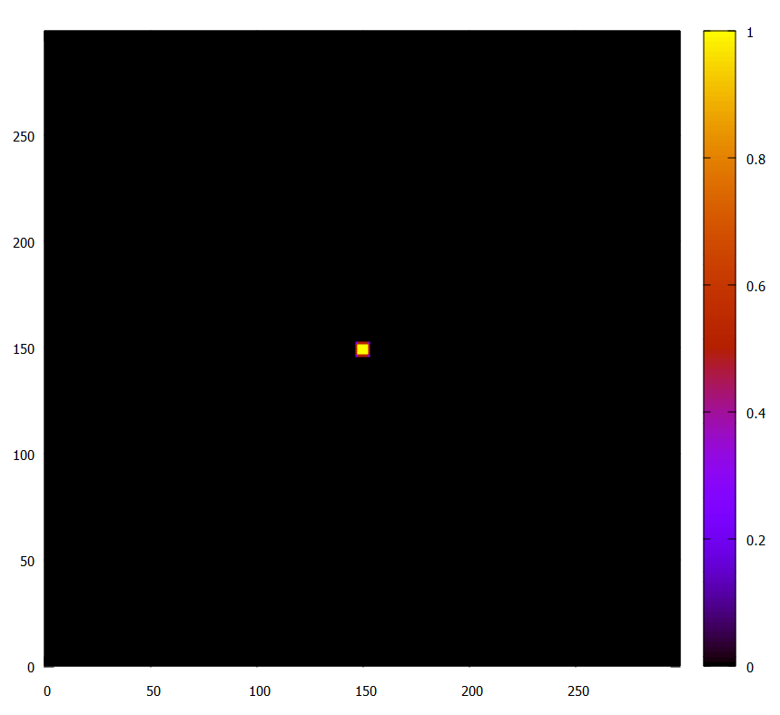
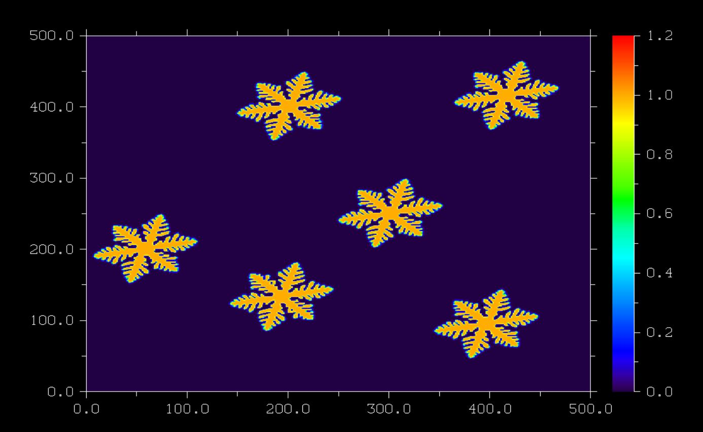

# **Fortran whole array usage in dendrite formation with phase-field method**

This work shows the usage of whole array technique for dendrite formation with phase field method.

## **How to use it to get initial microstructure?**

The whole array is convenient in getting initial microstructure. Solidification with phase field method requires two distinct region; One represents `solid` region and the other `liquid` region.

To get this, first we consider the whole simulation cell and put $\phi = 0$ with whole array technique. This presents the liquid region. The solid area is distinguished where $\phi = 1$. We want to insert it in the center. For that purpose, we use the array subsection technique. Hence by using just two lines, the code produces the initial microstructure.

```fortran
  phi = 0.0
  
  phi ( 148:153, 148:153 ) = 1.0
```



The other section of the code does not require whole array technique. Therefore, the evolution section is the same as in the [previous work](https://github.com/Shahid718/Programming-Phase-field-in-Fortran/tree/main/dendrite).

## **Minimum Dislin routines for continuous animation**

The next feature of this code is the minimum number of Dislin routine calls for the continuous animation. Offcourse, the decorations can always be added. It could be the background color, the format and size of the output, axis label, title, etc.

We define the `Dislin_color_animation( )` routine that is called in the time loop.

```Fortran
  call Metafl ( 'cons' )
  call Disini ( )

  ...
  call Dislin_color_animation ( )
  ...
  call Disfin ( )
  ...

  subroutine Dislin_color_animation ( )

    call autres ( Nx, Ny )

    if ( mod( istep, nprint ) .eq. 0 ) then 
       call erase ( )  
       call graf3 ( 0.d0, 300.d0, 0.d0, 50.d0, 0.d0, 300.d0,&
            & 0.d0, 50.d0, 0.0d0, 1.2d0, 0.0d0, 0.2d0 )
       call crvmat ( phi, Nx, Ny, 1, 1 )   
       call endgrf
       call sendbf ( )
    end if

  end subroutine Dislin_color_animation
```
`call Metafl( )` defines the plot file format. Here, console is the output format and we get the continous plot there. The next call `Disini( )` initializes dislin. These two routines should always be called before the time loop for animation.

`Dislin_color_animation ( )` is the user defined routine that is called in the time loop. It is defined as the internal subroutine and is defined in the `sub-program` section. `call Disfin ( )` terminates dislin.

`call autres( )` automatically selects the size of the colored rectangle. `call erase( )` erases the previous screen, `call graf3 ( )` plots the axis system for color graphics. The first four arguments are for x axis, second are for y axis and the last four are for the color bar. `call crvmat ( )`  plots color surface. `call endgrf ( )` terminates the axis system and goes back to level 1. `call sendbf ( )` is used to send the buffer to the screen.

## **Code size reduction**

The third attribute is the declaration and initialization of more than one parameter in a single statement. This reduces the code size.

```Fortran
  integer ( kind = 4 ), parameter :: Nx = 300 , Ny = 300 
  integer (kind = 4 ) :: nsteps = 2500 , nprint = 100 , istep
  real ( kind = 8 )   :: dtime  = 1.0e-4, start , finish, dx = 0.03 , dy = 0.03
  real ( kind = 8 )   :: tau   = 0.0003 , epsilonb = 0.01 , mu = 1.0
  real ( kind = 8 )   :: kappa = 1.8 , delta = 0.02 , aniso = 6.0 , alpha = 0.9
  real ( kind = 8 )   :: gama  = 10.0 , teq   = 1.0 , theta0= 0.2
  real ( kind = 8 )   :: pix   = 4.0*atan(1.0), phi_old, term1, term2, theta, m
  integer ( kind = 4 ):: i, j, ip, im, jp, jm
  real ( kind = 8 ), dimension( Nx, Ny ):: phi, tempr , lap_phi, lap_tempr
  real ( kind = 8 ), dimension( Nx, Ny ):: phidx, phidy , epsil, epsilon_deriv
```

# **Compile and run**

If [gfortran](https://www.linkedin.com/learning/introduction-to-fortran), [intel compiler](https://www.intel.com/content/www/us/en/developer/tools/oneapi/hpc-toolkit-download.html) and [dislin](https://dislin.de/) are successfully installed, then use the following command to compile and run:

>f90link -a -r8 main

Below we show the code execution on `windows 10` with `gfortran.`


# **Exercise**

If you are interested to introduce more than one initial nuclei in the system, it is simple with the same array technique. Try following:


```Fortran
  phi ( 193:196, 133:137 ) = 1.0
  phi ( 058:062, 200:204 ) = 1.0
  phi ( 300:304, 250:254 ) = 1.0
  phi ( 395:399, 095:099 ) = 1.0
  phi ( 200:204, 400:404 ) = 1.0
  phi ( 415:419, 415:419 ) = 1.0
```

You may get the same figure for `Nx = 500`, `Ny = 500`, and `nsteps = 1000`.

