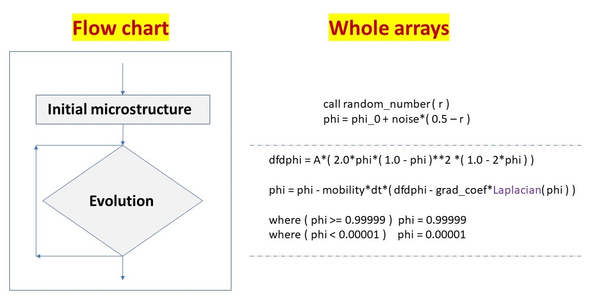

# **Fortran whole array usage in Allen-Cahn equation**

This work shows the whole array technique for model A phase field method.

Model A represents a code where the whole array technique can be used in both sections: initial microstructure and the evolution section (also discussed in the [introduction](https://github.com/Shahid718/Phase-field-Fortran-codes-using-whole-array)). The flow chart below demonstrates this.



The `laplacian` function is defined in the `subprogram` section together with the `Dislin_color_animation()`.

## **Minimum Dislin routines for continuous animation**

The second distinct feature of this code is the minimum number of Dislin routine calls for the continuous animation. Offcourse, the decorations can always be added. It could be the background color, the format and size of the output, axis label, title, etc.

We define the `Dislin_color_animation()` routine that is called in the time loop.

```Fortran
  call Metafl ( 'cons' )
  call Disini ( )

  ...
  call Dislin_color_animation ( )
  ...
  call Disfin ( )
  ...

  subroutine Dislin_color_animation ()

    call autres ( Nx, Ny )

    if ( mod( istep, nprint ) .eq. 0 ) then 
       call erase ( )  
       call graf3 ( 0.d0, 128.d0, 0.d0, 32.d0, 0.d0, 128.d0,&
            & 0.d0, 32.d0, 0.05d0, 1.0d0, 0.05d0, 0.1d0 )
       call crvmat ( phi, Nx, Ny, 1, 1 )   
       call endgrf
       call sendbf ( )
    end if

  end subroutine Dislin_color_animation
```
`call Metafl()` defines the plot file format. Here, console is the output format and we get the continous plot there. The next call `Disini()` initializes dislin. These two routines should always be called before the time loop.

`Dislin_color_animation ( )` is a user defined routine that is called in the time loop. It is defined as the internal subroutine and is defined in the `sub-program` section. `call Disfin ( )` terminates dislin.

`call autres()` automatically selects the size of the colored rectangle. `call erase()` erases the previous screen, `call graf3()` plots the axis system for color graphics. The first four arguments are for x axis, second are for y axis and the last four are for the color bar. `call crvmat ()`  plots color surface. `call endgrf()` terminates the axis system and goes back to level 1. `call sendbf()` is used to send the buffer to the screen.

## **Code size reduction**

The third attribute is the declaration and initialization of more than one parameter in a single statement. This reduces the code size.

```Fortran
  integer ( kind = 4 ), parameter :: Nx = 128 , Ny = 128
  integer ( kind = 4 ) :: nsteps = 1500 , nprint = 10 , istep
  real ( kind = 8 )    :: dt = 0.01 , start , finish
  real ( kind = 8 )    :: phi_0 = 0.5 , mobility = 1.0 , grad_coef = 1.0
  real ( kind = 8 )    :: noise = 0.02 , A = 1.0
  real ( kind = 8 ) , dimension ( Nx, Ny ) :: r , phi, dfdphi  
```

# **Compile and run**

If [gfortran](https://www.linkedin.com/learning/introduction-to-fortran), [intel compiler](https://www.intel.com/content/www/us/en/developer/tools/oneapi/hpc-toolkit-download.html) and [dislin](https://dislin.de/) are successfully installed, then use the following command to compile and run:

>f90link -a -r8 main

Below we show the code execution on `windows 10` with `gfortran.`


